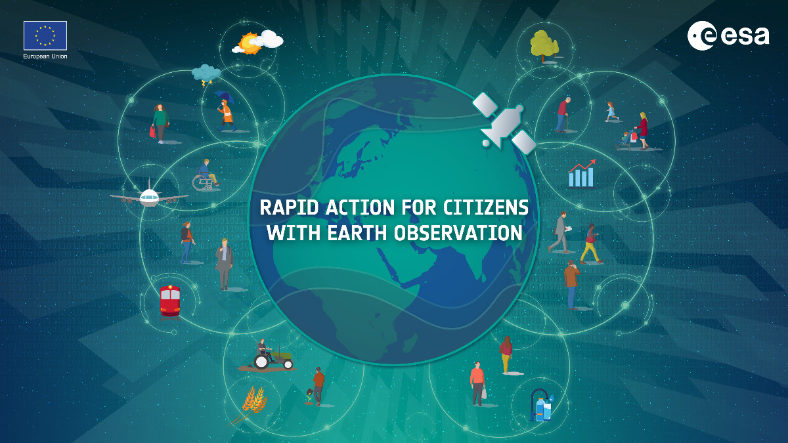

# eo_indicators
scripts developed by RHEA Group to exploit Earth Observation data from EuroDataCube

  

## Get started
[EuroDataCube](https://eurodatacube.com/)

Let us know if you have tried any of the solutions presented, we'd love to hear about your use cases!

## Disclaimer
The code available in this repository may produce results containing geographic information with limitations due to the scale, resolution, date and interpretation of the original source materials. No liability concerning the content or the use thereof is assumed by the producer.
