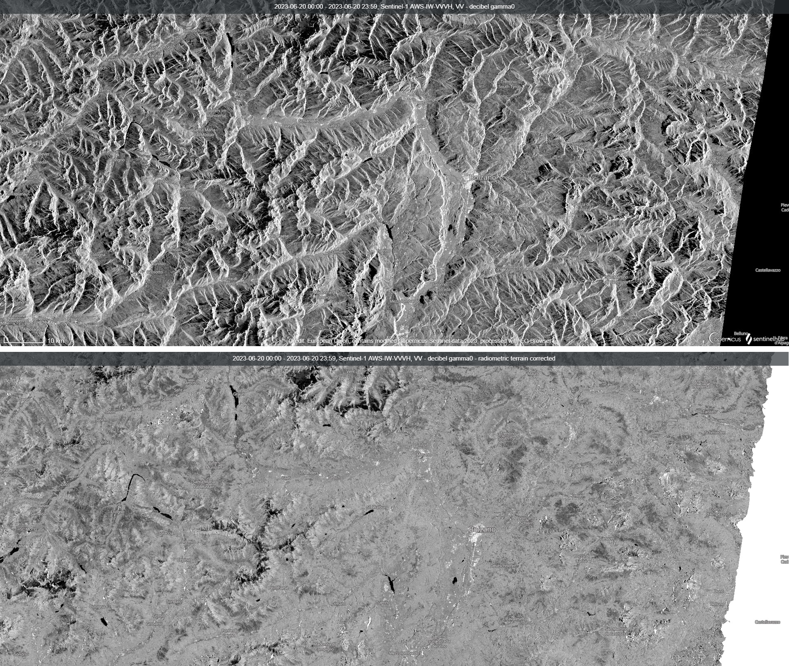
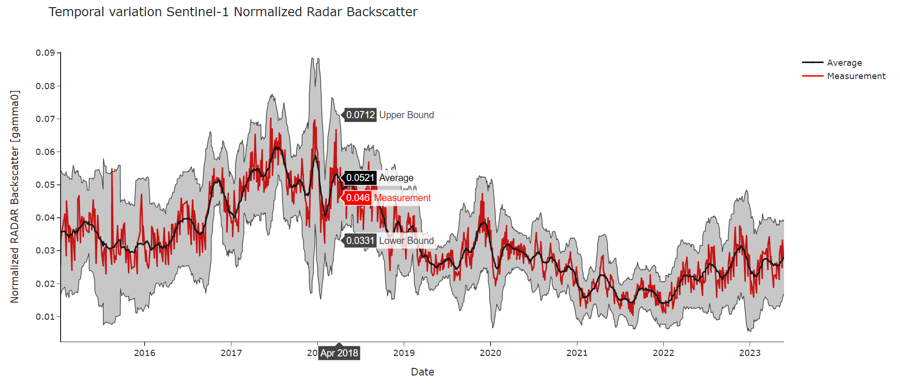

# Finished Goods Inventory indicator: 
This indicator uses the time series of Sentinel-1 Normalized Radar Backscatter of the VH polarization channel averaged over the user-defined area of interest (AOI) to provide a time overview of the backscatter variations which can be directly linked to the occupancy of the monitored areas.

## Input:
The input parameters needed are:
- **Observation period** start and stop in YYYY-MM-DD format
- **Area of Interest** (AOI) in Well-Known Text (WKT) format

The implemented algorithm will retrieve, using the SentinelHub Statistical API, the averaged terrain-flattened gamma0 VH over the defined AOI aggregated per day. Using gamma0 instead of the typical sigma0 allows us to aggregate the values from different orbits as it is geometry independent and corrected to remove its dependency on the incident angle and acquisition geometry.

The steps that this algorithm follows are:
1. Time series retrieval of the averaged gamma0 terrain flattened over the AOI
2. Outlier removal to remove and interpolate any possible outlier
3. Result publication 

The images below show the differences between gamma0 backscatter (top) and gamma0 with radiometric terrain correction or **flattened** (bottom) both in decibel scale available in SentinelHub.

  

More information about the **GAMMA0_TERRAIN** processing option available from Sentinelhub is available [here](https://docs.sentinel-hub.com/api/latest/data/sentinel-1-grd/#processing-options) and [here](https://collections.eurodatacube.com/card4l/)

## Output: 
The current implementation provides as output a Comma Separated Values (CSV) file containing acquisition dates and averaged gamma0 values over the AOI.

Additional customizations of this implementation could provide:
- RACE-compatible formatted CSV
- Static or interactive time series plot. An example of a possible plot of such variation could be: 

  

## Resources:
- See the full [Jupyter Notebook](code/RACE_FinishedGoodsInventory_inidcator.md),
- or download the working Jupyter Notebook from [here](code/RACE_FinishedGoodsInventory_inidcator.ipynb)

## Requirements:
- Processing resources: This algorithm is customized to run within the EDC EOX infrastructure using Jupyter-lab.
- User credentials: requires an active account with any of the available subscription plans.
