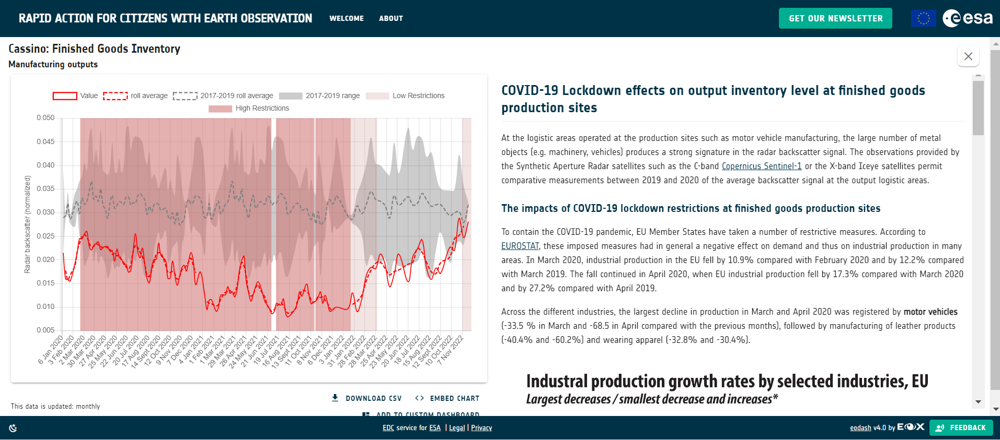

This section collects the information and resources of the RHEA Group open-source codes to retrieve EO-derived data linked to economic indicators such as Finished Goods Inventory or Parking Occupancy.

One example is the time series variability of the parking areas of Car Manufacturing, which is included in the [RACE Platform] (https://race.esa.int/). In particular, this economic indicator is called **Finished Goods Inventory**.

1. [Finihsed Goods Inventoryindicator](E8_S1_NRB/README.md):
The **Finished Goods Inventory indicator** uses Sentinel-1 Normalized Radar Backscatter (gamma0 flattened) time information to provide the entire time series information (starting in January 2015) over a user-defined Area of Interest (AOI).

An overview of the RACE platform overview showing the Finished Good Inventory information is available in the following image.

  

